# 📐 Diagrama de Arquitectura - Sistema de Procesamiento de Bloques Ethereum

## Diagrama Completo de Componentes y Relaciones

```mermaid
graph TB
    subgraph "🌐 CAPA DE PRESENTACIÓN"
        WEB[Panel Web Next.js<br/>localhost:3000]
        BROWSER[Usuario<br/>Navegador]
    end

    subgraph "🔌 CAPA DE API"
        API_METRICS[API: /api/metrics/system<br/>GET - Métricas globales]
        API_RPCS[API: /api/rpcs<br/>GET/PATCH - Gestión RPCs]
        API_CONSUMERS[API: /api/consumers<br/>GET - Lista consumidores]
        API_EVENTS[API: /api/events<br/>GET - Eventos procesados]
    end

    subgraph "💾 CAPA DE DATOS - PostgreSQL"
        DB[(PostgreSQL<br/>:5432)]

        subgraph "📊 Tablas"
            T_RPCS[rpcs<br/>50+ endpoints]
            T_EVENTS[events<br/>Eventos decodificados<br/>20 parámetros]
            T_CONSUMER[consumer_metrics<br/>Métricas por worker]
            T_SYSTEM[system_metrics<br/>Métricas globales]
        end
    end

    subgraph "🔄 CAPA DE MENSAJERÍA - RabbitMQ"
        RABBIT[RabbitMQ<br/>:5672]

        subgraph "📬 Colas"
            Q_MAIN[Cola Principal<br/>ethereum_blocks_queue]
            Q_RETRY[Cola Reintentos<br/>+ TTL 5s]
            Q_DEAD[Dead Letter Queue<br/>Mensajes fallidos]
        end
    end

    subgraph "⚙️ CAPA DE PROCESAMIENTO - Backend TypeScript"

        subgraph "📤 Productor"
            PRODUCER[Block Producer<br/>Genera rangos de bloques]
        end

        subgraph "👷 Workers/Consumidores"
            C1[Consumer 1<br/>UUID único]
            C2[Consumer 2<br/>UUID único]
            C3[Consumer 3<br/>UUID único]
            C4[Consumer 4<br/>UUID único]
            C5[Consumer 5<br/>UUID único]
        end

        subgraph "🛠️ Servicios Internos"
            SVC_BLOCKCHAIN[Blockchain Service<br/>Ethers.js v6]
            SVC_DECODER[Event Decoder<br/>4byte.directory + cache]
            SVC_RPC_POOL[RPC Pool Manager<br/>Asignación exclusiva]
            SVC_METRICS[Metrics Service<br/>Tracking]
        end
    end

    subgraph "🌍 CAPA EXTERNA"

        subgraph "🔗 RPCs Ethereum"
            RPC1[LlamaRPC<br/>eth.llamarpc.com]
            RPC2[BlockPi<br/>blockpi.network]
            RPC3[Tenderly<br/>tenderly.co]
            RPC4[BlastAPI<br/>blastapi.io]
            RPC5[Nodies<br/>nodies.app]
            RPC_MORE[... 45+ más]
        end

        FOURBYTE[4byte.directory API<br/>Decodificación eventos]
        ETHEREUM[Blockchain Ethereum<br/>Mainnet]
    end

    subgraph "🐳 INFRAESTRUCTURA - Docker"
        DOCKER_PG[Container PostgreSQL]
        DOCKER_RABBIT[Container RabbitMQ]
        DOCKER_FLYWAY[Container Flyway<br/>Migraciones]
    end

    %% Relaciones Usuario -> Web
    BROWSER -->|HTTP| WEB

    %% Relaciones Web -> APIs
    WEB -->|GET cada 5s| API_METRICS
    WEB -->|GET/PATCH| API_RPCS
    WEB -->|GET| API_CONSUMERS
    WEB -->|GET| API_EVENTS

    %% Relaciones APIs -> Base de Datos
    API_METRICS -->|SELECT| T_SYSTEM
    API_METRICS -->|SELECT SUM| T_CONSUMER
    API_RPCS -->|SELECT UPDATE| T_RPCS
    API_CONSUMERS -->|SELECT| T_CONSUMER
    API_EVENTS -->|SELECT| T_EVENTS

    %% Base de Datos
    DB --> T_RPCS
    DB --> T_EVENTS
    DB --> T_CONSUMER
    DB --> T_SYSTEM

    %% Relaciones Productor -> RabbitMQ
    PRODUCER -->|Publica mensajes<br/>rangos bloques| Q_MAIN

    %% Relaciones RabbitMQ
    RABBIT --> Q_MAIN
    RABBIT --> Q_RETRY
    RABBIT --> Q_DEAD
    Q_MAIN -->|En caso de error| Q_RETRY
    Q_RETRY -->|Después de TTL| Q_MAIN
    Q_MAIN -->|Fallos repetidos| Q_DEAD

    %% Relaciones Consumers -> RabbitMQ
    Q_MAIN -->|Consume mensajes| C1
    Q_MAIN -->|Consume mensajes| C2
    Q_MAIN -->|Consume mensajes| C3
    Q_MAIN -->|Consume mensajes| C4
    Q_MAIN -->|Consume mensajes| C5

    %% Relaciones Consumers -> Servicios
    C1 -->|Usa| SVC_RPC_POOL
    C2 -->|Usa| SVC_RPC_POOL
    C3 -->|Usa| SVC_RPC_POOL
    C4 -->|Usa| SVC_RPC_POOL
    C5 -->|Usa| SVC_RPC_POOL

    C1 -->|Usa| SVC_BLOCKCHAIN
    C2 -->|Usa| SVC_BLOCKCHAIN
    C3 -->|Usa| SVC_BLOCKCHAIN
    C4 -->|Usa| SVC_BLOCKCHAIN
    C5 -->|Usa| SVC_BLOCKCHAIN

    C1 -->|Usa| SVC_DECODER
    C2 -->|Usa| SVC_DECODER
    C3 -->|Usa| SVC_DECODER
    C4 -->|Usa| SVC_DECODER
    C5 -->|Usa| SVC_DECODER

    C1 -->|Escribe métricas| T_CONSUMER
    C2 -->|Escribe métricas| T_CONSUMER
    C3 -->|Escribe métricas| T_CONSUMER
    C4 -->|Escribe métricas| T_CONSUMER
    C5 -->|Escribe métricas| T_CONSUMER

    C1 -->|Guarda eventos| T_EVENTS
    C2 -->|Guarda eventos| T_EVENTS
    C3 -->|Guarda eventos| T_EVENTS
    C4 -->|Guarda eventos| T_EVENTS
    C5 -->|Guarda eventos| T_EVENTS

    %% Relaciones RPC Pool -> RPCs
    SVC_RPC_POOL -->|Lee estado| T_RPCS
    SVC_RPC_POOL -->|Asigna exclusivo| RPC1
    SVC_RPC_POOL -->|Asigna exclusivo| RPC2
    SVC_RPC_POOL -->|Asigna exclusivo| RPC3
    SVC_RPC_POOL -->|Asigna exclusivo| RPC4
    SVC_RPC_POOL -->|Asigna exclusivo| RPC5

    %% Relaciones Blockchain Service -> RPCs
    SVC_BLOCKCHAIN -->|getLogs getBlock| RPC1
    SVC_BLOCKCHAIN -->|getLogs getBlock| RPC2
    SVC_BLOCKCHAIN -->|getLogs getBlock| RPC3
    SVC_BLOCKCHAIN -->|getLogs getBlock| RPC4
    SVC_BLOCKCHAIN -->|getLogs getBlock| RPC5

    %% Relaciones RPCs -> Ethereum
    RPC1 -->|JSON-RPC| ETHEREUM
    RPC2 -->|JSON-RPC| ETHEREUM
    RPC3 -->|JSON-RPC| ETHEREUM
    RPC4 -->|JSON-RPC| ETHEREUM
    RPC5 -->|JSON-RPC| ETHEREUM

    %% Relaciones Decoder -> 4byte
    SVC_DECODER -->|GET event-signatures| FOURBYTE

    %% Relaciones Docker
    DOCKER_PG -.->|Contiene| DB
    DOCKER_RABBIT -.->|Contiene| RABBIT
    DOCKER_FLYWAY -.->|Ejecuta migraciones| DB

    %% Estilos
    classDef webStyle fill:#3b82f6,stroke:#1e40af,color:#fff
    classDef apiStyle fill:#8b5cf6,stroke:#6d28d9,color:#fff
    classDef dbStyle fill:#10b981,stroke:#059669,color:#fff
    classDef queueStyle fill:#f59e0b,stroke:#d97706,color:#fff
    classDef workerStyle fill:#ec4899,stroke:#be185d,color:#fff
    classDef serviceStyle fill:#06b6d4,stroke:#0891b2,color:#fff
    classDef externalStyle fill:#6b7280,stroke:#4b5563,color:#fff
    classDef dockerStyle fill:#1e293b,stroke:#0f172a,color:#fff

    class WEB,BROWSER webStyle
    class API_METRICS,API_RPCS,API_CONSUMERS,API_EVENTS apiStyle
    class DB,T_RPCS,T_EVENTS,T_CONSUMER,T_SYSTEM dbStyle
    class RABBIT,Q_MAIN,Q_RETRY,Q_DEAD queueStyle
    class C1,C2,C3,C4,C5,PRODUCER workerStyle
    class SVC_BLOCKCHAIN,SVC_DECODER,SVC_RPC_POOL,SVC_METRICS serviceStyle
    class RPC1,RPC2,RPC3,RPC4,RPC5,RPC_MORE,FOURBYTE,ETHEREUM externalStyle
    class DOCKER_PG,DOCKER_RABBIT,DOCKER_FLYWAY dockerStyle
```



---

## 🔄 Flujo de Datos Detallado

### 1️⃣ Flujo de Visualización (Panel Web)
```
Usuario → Panel Web → API REST → PostgreSQL → Respuesta JSON → Renderizado
  └─> Auto-refresh cada 5s
```

### 2️⃣ Flujo de Procesamiento de Bloques
```
1. Productor
   └─> Genera mensaje: {startBlock: 18000000, endBlock: 18000100}
   └─> Publica en RabbitMQ (Cola Principal)

2. RabbitMQ
   └─> Distribuye mensaje a Consumer disponible

3. Consumer (Worker)
   ├─> Asigna RPC exclusivo del pool
   ├─> Crea métrica en consumer_metrics (status: processing)
   ├─> Llama Blockchain Service
   │   └─> Ethers.js → RPC → Ethereum Mainnet
   │       └─> getLogs(startBlock, endBlock)
   ├─> Procesa logs con Event Decoder
   │   └─> Consulta 4byte.directory (con cache)
   │       └─> Obtiene nombre del evento
   ├─> Guarda eventos en tabla 'events' (batch)
   ├─> Actualiza métrica (status: completed)
   └─> Libera RPC del pool

4. En caso de error
   └─> Mensaje va a Cola de Reintentos (TTL 5s)
   └─> Después de TTL, vuelve a Cola Principal
   └─> Si falla 3+ veces → Dead Letter Queue
```

### 3️⃣ Flujo de Gestión de RPCs
```
Usuario → Panel Web → PATCH /api/rpcs
  └─> UPDATE rpcs SET active = false WHERE id = X
  └─> Respuesta → UI actualizada
  └─> Consumers no usarán ese RPC
```

---

## 📊 Diagrama Simplificado (Vista General)

```
┌─────────────────────────────────────────────────────────────┐
│                    👤 USUARIO                               │
│                       ↓                                      │
│            🌐 Panel Web (Next.js)                           │
│                       ↓                                      │
│            📡 API REST (4 endpoints)                        │
└─────────────────────┬───────────────────────────────────────┘
                      │
                      ↓
┌─────────────────────────────────────────────────────────────┐
│              💾 PostgreSQL Database                         │
│  ┌──────────┬──────────┬───────────┬──────────┐           │
│  │   rpcs   │  events  │ consumer_ │ system_  │           │
│  │  (50+)   │  (logs)  │ metrics   │ metrics  │           │
│  └──────────┴──────────┴───────────┴──────────┘           │
└───────────────────┬─────────────────────────────────────────┘
                    │                        ↑
                    ↓                        │ (escribe)
┌─────────────────────────────────────────────────────────────┐
│                ⚙️ Backend (TypeScript)                      │
│                                                              │
│  📤 Productor ──────▶ 🔄 RabbitMQ Queues                   │
│                           │                                  │
│                           ├─▶ 👷 Consumer 1 ← RPC 1        │
│                           ├─▶ 👷 Consumer 2 ← RPC 2        │
│                           ├─▶ 👷 Consumer 3 ← RPC 3        │
│                           ├─▶ 👷 Consumer 4 ← RPC 4        │
│                           └─▶ 👷 Consumer 5 ← RPC 5        │
│                                      │                       │
│                                      ↓                       │
│                           🛠️ Blockchain Service             │
│                           🛠️ Event Decoder                  │
└───────────────────────────┬─────────────────────────────────┘
                            │
                            ↓
┌─────────────────────────────────────────────────────────────┐
│                  🌍 SERVICIOS EXTERNOS                      │
│                                                              │
│  🔗 50+ RPCs Ethereum  ←──▶  ⛓️ Ethereum Mainnet          │
│  📚 4byte.directory API                                     │
└─────────────────────────────────────────────────────────────┘
```

---

## 🎯 Componentes Clave y sus Responsabilidades

### Panel Web (Next.js)
| Componente | Responsabilidad |
|------------|-----------------|
| Dashboard (`/`) | Mostrar métricas globales y tabla de consumidores |
| Gestión RPCs (`/rpcs`) | Activar/desactivar RPCs en tiempo real |
| API Routes | Conectar frontend con PostgreSQL |
| Auto-refresh | Actualizar datos cada 5 segundos |

### Backend
| Componente | Responsabilidad |
|------------|-----------------|
| **Productor** | Generar mensajes con rangos de bloques |
| **Consumer** | Procesar bloques, extraer eventos, guardar en BD |
| **RPC Pool Manager** | Asignar RPCs exclusivos a cada consumer |
| **Blockchain Service** | Interactuar con Ethereum vía Ethers.js |
| **Event Decoder** | Decodificar eventos usando 4byte.directory |
| **Metrics Service** | Registrar métricas de rendimiento |

### Base de Datos
| Tabla | Propósito |
|-------|-----------|
| **rpcs** | Estado de 50+ endpoints (activo, en uso, métricas) |
| **events** | Eventos decodificados (20 parámetros) |
| **consumer_metrics** | Métricas por cada ejecución de worker |
| **system_metrics** | Métricas globales agregadas |

### RabbitMQ
| Cola | Propósito |
|------|-----------|
| **ethereum_blocks_queue** | Cola principal de trabajo |
| **retry_queue** | Reintentos automáticos (TTL 5s) |
| **dead_letter_queue** | Mensajes que fallaron múltiples veces |

---

## 🔐 Comunicación entre Componentes

### Protocolos
- **HTTP/REST**: Panel Web ↔ API Routes
- **PostgreSQL Wire Protocol**: APIs ↔ PostgreSQL
- **AMQP**: Backend ↔ RabbitMQ
- **JSON-RPC**: Ethers.js ↔ RPCs Ethereum
- **HTTPS**: Event Decoder ↔ 4byte.directory

### Puertos
- `3000`: Panel Web (Next.js)
- `5432`: PostgreSQL
- `5672`: RabbitMQ (AMQP)
- `15672`: RabbitMQ Management UI

---

## 🚦 Estados de los Componentes

### Consumer States
```
┌──────────┐    ┌────────────┐    ┌───────────┐
│  Idle    │ ─▶ │ Processing │ ─▶ │ Completed │
└──────────┘    └─────┬──────┘    └───────────┘
                      │
                      ▼
                ┌──────────┐
                │  Failed  │
                └─────┬────┘
                      │
                      ▼
                ┌──────────┐
                │ Retrying │
                └──────────┘
```

### RPC States
```
┌──────────┐    ┌─────────┐    ┌──────────┐
│ Inactive │ ◀─▶│ Active  │ ─▶ │ In Use   │
└──────────┘    └─────────┘    └────┬─────┘
                                     │
                                     ▼
                               ┌──────────┐
                               │ Released │
                               └────┬─────┘
                                    │
                                    ▼
                               ┌─────────┐
                               │ Active  │
                               └─────────┘
```

---

## 📈 Escalabilidad del Sistema

### Horizontal
```
1 Worker  ────▶  5 Workers  ────▶  10+ Workers
   │                 │                   │
   ▼                 ▼                   ▼
1 RPC         5 RPCs activos      10+ RPCs activos
```

### Capacidad
- **1 Worker**: ~100 bloques/minuto
- **5 Workers**: ~500 bloques/minuto
- **10 Workers**: ~1,000 bloques/minuto
- **50 Workers**: ~5,000 bloques/minuto (teórico)

---

## 🔄 Ciclo de Vida de un Bloque

```
1. [Productor] Genera mensaje
   ↓
2. [RabbitMQ] Almacena en cola
   ↓
3. [Consumer] Consume mensaje
   ↓
4. [RPC Pool] Asigna RPC exclusivo
   ↓
5. [Blockchain Service] Obtiene logs del rango
   ↓
6. [Event Decoder] Decodifica eventos
   ↓
7. [PostgreSQL] Guarda eventos (batch)
   ↓
8. [Metrics] Actualiza estadísticas
   ↓
9. [RPC Pool] Libera RPC
   ↓
10. [RabbitMQ] ACK mensaje (completado)
```

---

Este diagrama muestra cómo todos los componentes del sistema trabajan juntos para procesar bloques de Ethereum de forma distribuida, escalable y tolerante a fallos.
